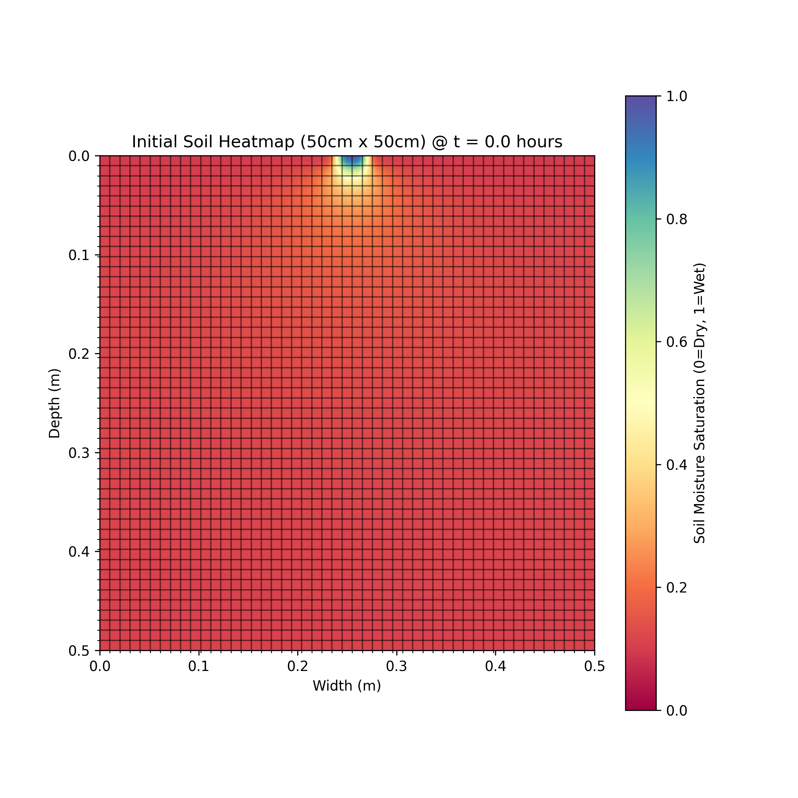
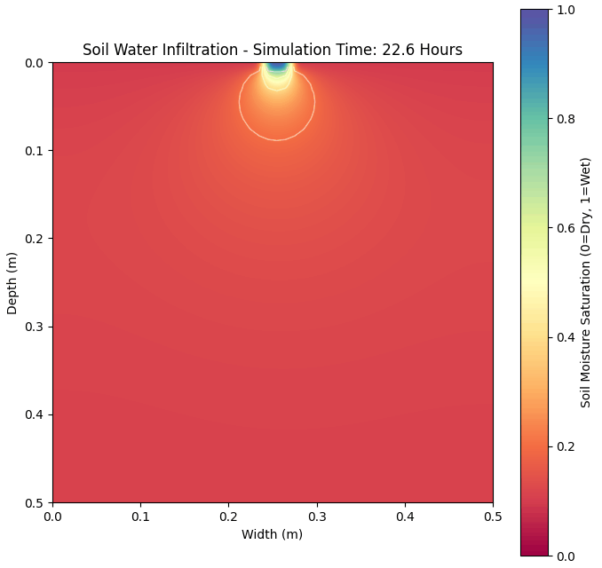

# 2D Numerical Simulation of Soil Water Infiltration in Loam Soil


This project implements a **Finite Difference** numerical solver to model moisture transport in unsaturated porous media. This project simulates the radial expansion of a "wetting bulb" from a drip emitter, providing insights into precision irrigation and root-zone water distribution.

## 📌 Project Overview

Optimizing water use in agriculture is critical for global food security, particularly in arid regions. This project leverages the **2D Diffusion Equation** to visualize how water moves through loam soil over a 24-hour period. By calculating hydraulic gradients and front propagation, the model helps determine ideal emitter placements and irrigation durations.

## 🛠️ Tech Stack

* **Programming Language:** Python
* **Numerical Computing:** NumPy
* **Visualization:** Matplotlib
* **Animation Engine:** Matplotlib.animation
* **Mathematical Method:** Explicit Finite Difference Method

## ⚙️ Key Features

* **Explicit FDM Solver:** Uses a 5-point stencil to solve the 2D Laplacian operator.
* **Vectorized Computation:** Optimized with NumPy slicing to process the entire grid simultaneously without slow loops.
* **Stability Control:** Implements the **CFL (Courant-Friedrichs-Lewy) condition** to ensure mathematical convergence.
* **Wetting Bulb Visualization:** Generates time-lapse GIFs and static heatmaps with moisture contours.

## 📂 Physics & Parameters

The model simulates a vertical cross-section of a soil profile:

* **Domain Size:**  (Root Zone)
* **Grid Resolution:**  Nodes
* **Soil Type:** Loam (Diffusivity )
* **Boundary Conditions:** * **Inflow:** Dirichlet Condition at the emitter.
* **Walls:** Zero-Flux Neumann Conditions.


## 📁 Repository Structure

<pre>
├── results
│   ├── soil_moisture_22h.png  
│   ├── soil_plot_timelapse.gif
│   ├── soil_plot_initial.png 
├── sim_file
│   ├── soil_water_sim.ipynb  
├── LICENSE
├── README.md
└── requirements.txt                
</pre>

## 🚀 Getting Started

### Prerequisites

**Python 3.8+**

### 1. Clone the Repository

```bash
git clone https://github.com/Oluwatobi-coder/2D-Soil-Moisture-Infiltration-FDM.git
cd 2D-Soil-Moisture-Infiltration-FDM

```

### 2. Install Dependencies

```bash
pip install -r requirements.txt

```

### 3. Run the Simulation

* Navigate too the `sim_file` directory.

* Open the `soil_water_sim.ipynb` file. Run each cell


## 🧠 Numerical Implementation

The core logic solves the following Partial Differential Equation (PDE):

1. **Discretization:** The continuous soil space is divided into a  grid.
2. **Stencil Computation:** The solver calculates the next moisture state by comparing each point to its Top, Bottom, Left, and Right neighbors.
3. **Time-Stepping:** The simulation progresses in small  increments to maintain numerical stability and avoid oscillation errors.

## 📊 Results

* **State @ 0.0 Hours:** Shows the dry soil initialized with a 50x50 mesh grid, highlighting the spatial discretization.
* **State @ >20.0 Hours:** Displays the established wetting bulb, where the color gradient (Spectral) visualizes the transition from saturated (blue) to dry (red) zones.

<p align="center">

20 hrs" />
</p>

## 🤝 Contributing

Contributions are welcome! If you want to implement the non-linear Richards Equation or add Root Water Uptake (RWU) models:

1. Fork the repository.
2. Create a feature branch (`git checkout -b feature-physics`).
3. Commit your changes.
4. Open a Pull Request.

## 📜 License

This project is licensed under the MIT License.


If you find this simulation helpful for your research in sustainable agriculture, feel free to ⭐ the repository!
